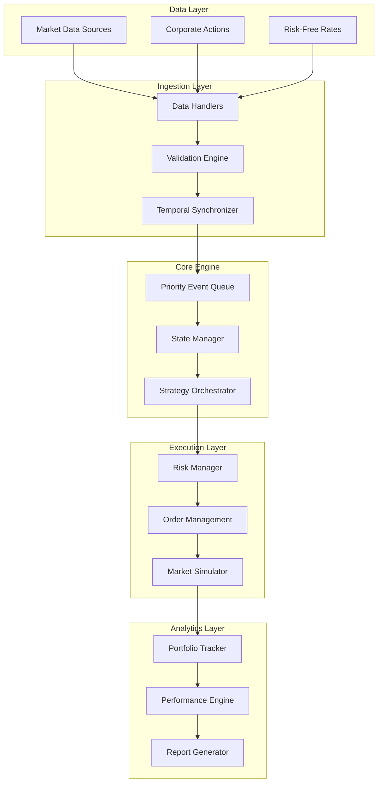

# System Architecture Documentation

## Overview

This document explains the system architecture of this backtesting engine and assesses the scalability of the system.

## High-Level Architecture



## Core Design Principles

### 1. Event-Driven Architecture

**Design Rationale**: Traditional backtesting engines often use vectorized approaches that process entire datasets at once. While computationally efficient, this approach fails to capture the temporal dynamics crucial for realistic trading simulation.

**Implementation**: 
- **Priority Queue**: Custom implementation using Python's `heapq` with event priorities
- **Temporal Ordering**: Strict chronological processing ensures lookahead bias elimination
- **Event Types**: Four core event types (Market, Signal, Order, Fill) with extensible framework

```python
class Event(BaseModel):
    """Base event class with Pydantic v2 validation"""
    timestamp: datetime
    priority: int = Field(default=0)
    event_type: EventType
    
    def __lt__(self, other: 'Event') -> bool:
        """Priority queue ordering: timestamp first, then priority"""
        if self.timestamp != other.timestamp:
            return self.timestamp < other.timestamp
        return self.priority < other.priority

class BacktestEngine:
    def __init__(self):
        self.event_queue: List[Event] = []  # Min-heap implementation
        
    def _process_events(self):
        """Main event processing loop with O(log n) complexity"""
        while self.event_queue:
            event = heapq.heappop(self.event_queue)
            self._dispatch_event(event)
```

### 2. Type Safety with Pydantic v2

**Challenge Faced**: Financial data processing is prone to silent errors due to type mismatches, precision loss, and data corruption; exacerbated by traditional Python's dynamic typing.

**Solution**: Pydantic validation for all data structures:

```python
class MarketEvent(Event):
    symbol: str = Field(min_length=1, max_length=10)
    open_price: Decimal = Field(gt=0)
    high_price: Decimal = Field(gt=0)
    low_price: Decimal = Field(gt=0)
    close_price: Decimal = Field(gt=0)
    volume: int = Field(ge=0)
    
    @field_validator('high_price')
    @classmethod
    def validate_high_price(cls, v, info):
        """Ensure high >= max(open, close, low)"""
        if 'open_price' in info.data and v < info.data['open_price']:
            raise ValueError('High price cannot be less than open price')
        return v
```

### 3. Memory-Efficient Data Management

**Challenge**: Backtesting large universes over extended periods requires careful memory management to prevent OOM errors.

**Strategy**:
- **Lazy Loading**: Market data loaded in chunks based on strategy requirements
- **Reference Counting**: Automatic cleanup of processed events
- **Optimized Data Structures**: Custom containers for historical data

```python
class DataManager:
    def __init__(self, max_memory_mb: int = 2048):
        self._cache: Dict[str, pd.DataFrame] = {}
        self._memory_usage = 0
        self._max_memory = max_memory_mb * 1024 * 1024
        
    def load_symbol_data(self, symbol: str, start_date: datetime) -> Iterator[MarketEvent]:
        """Generator-based data loading for memory efficiency"""
        if self._memory_usage > self._max_memory:
            self._evict_oldest_data()
            
        for chunk in pd.read_csv(f'data/{symbol}.csv', chunksize=10000):
            chunk = chunk[chunk['date'] >= start_date]
            for _, row in chunk.iterrows():
                yield MarketEvent(
                    timestamp=pd.to_datetime(row['date']),
                    symbol=symbol,
                    open_price=Decimal(str(row['open'])),
                    # ... other fields
                )
```

## Component Deep Dive

### Event Queue Implementation

**Technical Details**:
- **Data Structure**: Binary min-heap for O(log n) insertion/removal
- **Concurrency**: Thread-safe operations for future multi-threading support
- **Capacity**: Dynamic sizing with configurable memory limits

```python
class PriorityEventQueue:
    def __init__(self, max_size: int = 1_000_000):
        self._heap: List[Event] = []
        self._event_count = 0
        self._max_size = max_size
        self._lock = threading.RLock()
        
    def push(self, event: Event) -> None:
        with self._lock:
            if self._event_count >= self._max_size:
                raise MemoryError("Event queue capacity exceeded")
            heapq.heappush(self._heap, event)
            self._event_count += 1
            
    def pop(self) -> Optional[Event]:
        with self._lock:
            if not self._heap:
                return None
            event = heapq.heappop(self._heap)
            self._event_count -= 1
            return event
```

### Portfolio Management Architecture

**Design Goals**:
- **Real-time P&L**: Sub-millisecond position valuation
- **Multi-currency Support**: Cross-currency exposure tracking
- **Margin Calculation**: Dynamic margin requirements
- **Corporate Actions**: Automatic handling of splits/dividends

```python
class Portfolio:
    def __init__(self, initial_capital: Decimal):
        self.cash: Decimal = initial_capital
        self.positions: Dict[str, Position] = {}
        self._market_data_cache: Dict[str, MarketEvent] = {}
        self._performance_history: List[PortfolioSnapshot] = []
        
    def calculate_total_equity(self) -> Decimal:
        """Calculate total portfolio value with O(n) complexity"""
        total = self.cash
        
        for symbol, position in self.positions.items():
            if position.quantity == 0:
                continue
                
            current_price = self._get_current_price(symbol)
            market_value = position.quantity * current_price
            total += market_value
            
        return total
    
    def update_from_fill(self, fill: FillEvent) -> None:
        """Process trade execution with proper accounting"""
        # Update position
        if fill.symbol not in self.positions:
            self.positions[fill.symbol] = Position(symbol=fill.symbol)
            
        position = self.positions[fill.symbol]
        
        if fill.side == OrderSide.BUY:
            position.quantity += fill.quantity
            self.cash -= fill.quantity * fill.fill_price + fill.commission
        else:
            position.quantity -= fill.quantity
            self.cash += fill.quantity * fill.fill_price - fill.commission
            
        # Update average cost basis
        if position.quantity > 0:
            position.avg_cost = (
                position.avg_cost * position.quantity + 
                fill.quantity * fill.fill_price
            ) / (position.quantity + fill.quantity)
```

### Strategy Framework Architecture

**Extensibility Design**:
- **Abstract Base Class**: Enforces consistent interface across strategies
- **Lifecycle Management**: Automatic indicator updates and state management
- **Resource Isolation**: Each strategy maintains independent state

```python
class BaseStrategy(ABC):
    def __init__(self, strategy_id: str, symbols: List[str], parameters: Dict[str, Any]):
        self.strategy_id = strategy_id
        self.symbols = set(symbols)
        self.parameters = parameters
        self._indicators: Dict[str, Any] = {}
        self._price_history: Dict[str, Deque[Decimal]] = defaultdict(
            lambda: deque(maxlen=1000)
        )
        
    @abstractmethod
    def generate_signals(
        self, 
        market_data: MarketDataSnapshot, 
        portfolio: Portfolio
    ) -> List[SignalEvent]:
        """Strategy-specific signal generation logic"""
        pass
        
    def update_indicators(self, market_data: MarketDataSnapshot) -> None:
        """Update technical indicators with new market data"""
        for symbol, market_event in market_data.data.items():
            if symbol not in self.symbols:
                continue
                
            # Update price history
            self._price_history[symbol].append(market_event.close_price)
            
            # Update indicators
            self._update_sma(symbol)
            self._update_bollinger_bands(symbol)
            self._update_rsi(symbol)
            
    def _update_sma(self, symbol: str, period: int = 20) -> None:
        """Simple Moving Average calculation"""
        prices = list(self._price_history[symbol])
        if len(prices) >= period:
            sma = sum(prices[-period:]) / period
            self._indicators[f'{symbol}_sma_{period}'] = sma
```

## Performance Optimizations

### 1. Numerical Computation

**Decimal vs Float Trade-offs**:
- **Precision**: `Decimal` for financial calculations eliminates floating-point errors
- **Performance**: NumPy arrays for bulk statistical computations
- **Hybrid Approach**: Decimal for accounting, float64 for analytics

```python
class PerformanceOptimizedCalculations:
    @staticmethod
    @lru_cache(maxsize=1000)
    def calculate_volatility(prices_tuple: Tuple[float, ...], window: int) -> float:
        """Cached volatility calculation with NumPy optimization"""
        prices = np.array(prices_tuple)
        returns = np.diff(np.log(prices))
        return np.std(returns[-window:]) * np.sqrt(252)
    
    @staticmethod
    def batch_portfolio_calculations(
        positions: Dict[str, Position],
        market_data: Dict[str, Decimal]
    ) -> Dict[str, Decimal]:
        """Vectorized portfolio value calculations"""
        symbols = list(positions.keys())
        quantities = np.array([positions[s].quantity for s in symbols])
        prices = np.array([float(market_data[s]) for s in symbols])
        
        market_values = quantities * prices
        return dict(zip(symbols, market_values))
```

### 2. Database Integration

**Schema Design for Performance**:

```sql
-- Optimized market data schema
CREATE TABLE market_data (
    symbol VARCHAR(10) NOT NULL,
    date DATE NOT NULL,
    open_price DECIMAL(15,4) NOT NULL,
    high_price DECIMAL(15,4) NOT NULL,
    low_price DECIMAL(15,4) NOT NULL,
    close_price DECIMAL(15,4) NOT NULL,
    volume BIGINT NOT NULL,
    PRIMARY KEY (symbol, date)
) PARTITION BY RANGE (date);

-- Partitioning for query performance
CREATE TABLE market_data_2023 PARTITION OF market_data
    FOR VALUES FROM ('2023-01-01') TO ('2024-01-01');

-- Indexes for common query patterns
CREATE INDEX idx_market_data_symbol_date ON market_data (symbol, date DESC);
CREATE INDEX idx_market_data_date_volume ON market_data (date, volume) 
    WHERE volume > 1000000;
```

### 3. Concurrency Architecture

**Future-Proofing for Scale**:

```python
class ConcurrentBacktestEngine:
    def __init__(self, num_workers: int = None):
        self.num_workers = num_workers or cpu_count()
        self.executor = ThreadPoolExecutor(max_workers=self.num_workers)
        
    async def run_parallel_strategies(
        self, 
        strategies: List[BaseStrategy]
    ) -> List[BacktestResults]:
        """Execute multiple strategies concurrently"""
        tasks = []
        for strategy in strategies:
            engine = BacktestEngine()
            engine.add_strategy(strategy)
            task = self.executor.submit(engine.run)
            tasks.append(task)
            
        results = []
        for future in concurrent.futures.as_completed(tasks):
            results.append(future.result())
            
        return results
```

## Error Handling & Reliability

### Graceful Degradation

```python
class RobustBacktestEngine(BacktestEngine):
    def __init__(self, *args, **kwargs):
        super().__init__(*args, **kwargs)
        self.error_handler = ErrorHandler()
        self.circuit_breaker = CircuitBreaker(failure_threshold=10)
        
    def _process_event_safely(self, event: Event) -> bool:
        """Process event with comprehensive error handling"""
        try:
            with self.circuit_breaker:
                self._process_event(event)
                return True
        except ValidationError as e:
            self.error_handler.log_validation_error(event, e)
        except CalculationError as e:
            self.error_handler.log_calculation_error(event, e)
        except Exception as e:
            self.error_handler.log_unexpected_error(event, e)
            
        return False
```

## Monitoring & Observability

### Real-time Metrics

```python
class BacktestMetrics:
    def __init__(self):
        self.start_time = time.time()
        self.events_processed = 0
        self.errors_encountered = 0
        self.memory_usage_history = []
        
    def record_event_processed(self):
        self.events_processed += 1
        if self.events_processed % 10000 == 0:
            self._log_progress()
            
    def _log_progress(self):
        elapsed = time.time() - self.start_time
        rate = self.events_processed / elapsed
        memory_mb = psutil.Process().memory_info().rss / 1024 / 1024
        
        logger.info(f"Processed {self.events_processed:,} events "
                   f"at {rate:.0f} events/sec, "
                   f"Memory: {memory_mb:.1f}MB")
```

## Testing Architecture

### Property-Based Testing

```python
@given(
    prices=st.lists(st.floats(min_value=1.0, max_value=1000.0), min_size=100),
    positions=st.dictionaries(
        st.text(min_size=3, max_size=5),
        st.integers(min_value=-1000, max_value=1000)
    )
)
def test_portfolio_value_properties(prices, positions):
    """Portfolio calculations should satisfy mathematical properties"""
    portfolio = Portfolio(Decimal('1000000'))
    
    # Setup positions
    for symbol, quantity in positions.items():
        if quantity != 0:
            portfolio.positions[symbol] = Position(symbol=symbol, quantity=quantity)
    
    # Property: Portfolio value should be monotonic with price increases
    for i, price in enumerate(prices):
        market_data = {symbol: Decimal(str(price)) for symbol in positions}
        value_before = portfolio.calculate_total_equity()
        
        # Increase all prices by 1%
        adjusted_data = {s: p * Decimal('1.01') for s, p in market_data.items()}
        portfolio.update_market_data(adjusted_data)
        value_after = portfolio.calculate_total_equity()
        
        # Long positions should increase portfolio value
        if all(q >= 0 for q in positions.values()):
            assert value_after >= value_before
```

## Scalability Considerations

### Horizontal Scaling Design

```python
class DistributedBacktestEngine:
    """Framework for distributed backtesting across multiple nodes"""
    
    def __init__(self, cluster_config: Dict[str, Any]):
        self.redis_client = redis.Redis(**cluster_config['redis'])
        self.task_queue = Queue('backtest_tasks', connection=self.redis_client)
        
    def submit_parameter_sweep(
        self, 
        strategy_class: Type[BaseStrategy],
        parameter_grid: Dict[str, List[Any]]
    ) -> str:
        """Distribute parameter sweep across cluster"""
        job_id = str(uuid.uuid4())
        
        # Generate parameter combinations
        param_combinations = list(product(*parameter_grid.values()))
        
        for params in param_combinations:
            task = BacktestTask(
                job_id=job_id,
                strategy_class=strategy_class,
                parameters=dict(zip(parameter_grid.keys(), params))
            )
            self.task_queue.enqueue(self._run_backtest_task, task)
            
        return job_id
```
